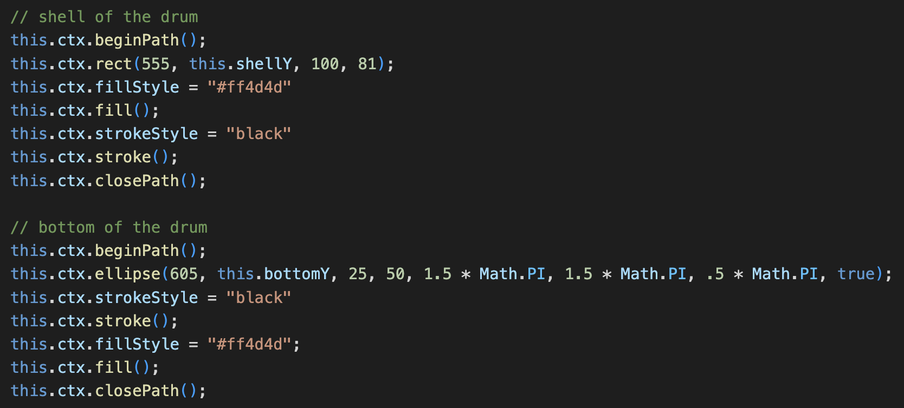
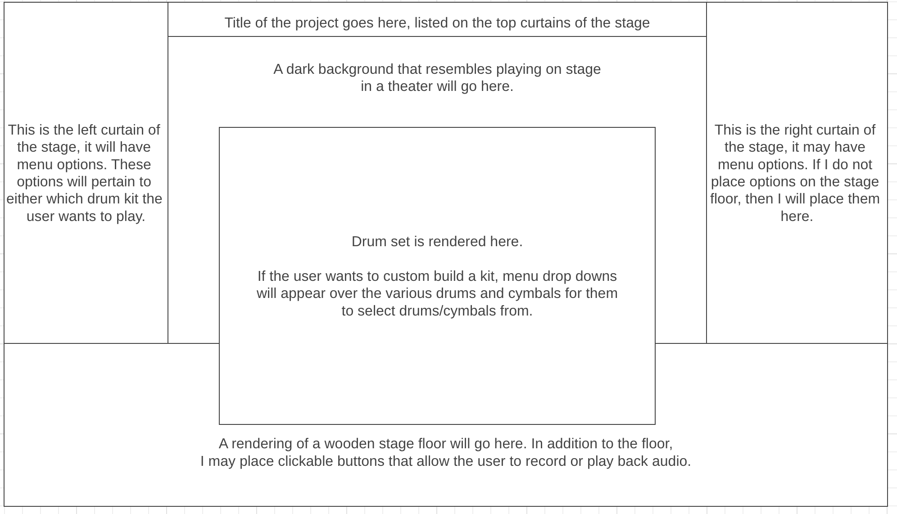

In the Pocket is an interactive drum set simulator you can use in your browser. Using your keyboard you can play using two preset drum kits: Rock, and Electronic. If you wish you can also build a custom drum kit from a wide range of our available drums and cymbals (coming soon). Once you're ready to begin recording your first album you can use the recording feature and hear back your playing (coming soon).

[Live Link](https://emmettwex.github.io/In-the-Pocket/)

Highlight of this project:
The drum set is made from scratch using canvas drawing. This made the animation process slightly more complex as it meant it was important to keep track of position variables for specific pieces of each drum individually so that they move and are rendered in unison. Each drum is a collection of a plethora of canvas-drawn shapes styled to and there are several drums and cymbals all drawn and tracked this way.

See below for some of the code used to draw the floor tom.

How To Use:
In The Pocket is designed to be drums at your fingertips, so you will be using the keyboard to play.
For your bass drum you will use the space bar or 1 to play
For your snare drum you will use 2 and Y to play
For your one tom you will use 3 and U to play
For your two tom you will use 4 and I to play
For your floor tom you will use 5 and O to play
For your open high hat you will use 6 to play
For your closed high hats you will use 7 and E to play
For your ride cymbal you will use 8 and R to play
For your crash one you will use 9 to play
For your crash two you will use 0 to play

You also have the ability to switch between two pre-set kits if you like. The default drum kit is the rock kit. Use the buttons on the left of the screen to switch between the kits.

If you forget your controls look to the bottom left of the screen for a key.

Project Layout
  - See below for the Wireframe:

Technologies, Libraries, APIs
  - The drum set and background are two separate canvas's. The background is an image being pulled from the asset folder. The drumset however is a separate canvas drawn completely from scratch.
  - The audio recording and playing capabilities are using the Howler.js library. The audio files are very easy to play and are being pulled from the assets folder.
  - Drum audio samples are from the free-to-download Eraser Fase kit 001: 68 classic drum machines: https://eraserfase.com/collections/sample-packs/products/kit-001-68-classic-drum-machines

Implementation Timeline:
  - Friday Afternoon: Create basic functionality, more specifically create working eventListeners for keystrokes and output a sound bite.

  - Weekend: 
    - Saturday: Compile audio files that I will use in the project.
        - Preset kits will be in their own folders in the audio directory.
        - Custom options will be in their own folders as well, based on which drum or cymbal they are to be associated with.
        - Attempt to familiarize myself with the API & Libraries I am using, create working eventHandlers that trigger at least one of the preset kits.
    - Sunday: Begin working on building out a basic template for the website on canvas. Get a simple background and drums/cymbals designed. This may not be the final design.
  - Monday: Get more into the details of assembling the drum kit on the stage. At this point my buttons should work, I would like to be able to select from preset kits by the end of Monday and play on all of them. Animation for the drum kit may not yet be built out here.
  - Tuesday: Build out the animation for the movement of drums when they are struck, focus on front end today. Want to make things look beautiful.
  - Wednesday: Build out the ability to custom assemble a kit to use on the stage. I would also like to build out the ability for the user to record their drum tracks and play them back.
  - Thursday: The project should be done by this point, but this day will be used for any finishing touches I need. Present and be proud!

Checklist:

Live Project
☐ Includes links to your portfolio website, Github, and LinkedIn.

☐ Landing page/modal with obvious, clear instructions.

☐ Interactivity of some kind.

☐ Well styled, clean frontend.

☐ If it has music, the option to mute or stop it.

Production README
☐ Link to live version.

☐ Instructions on how to play/interact with the project.

☐ List of technologies / libraries / APIs used.

☐ Technical implementation details with (good-looking) code snippets.

☐ To-dos / future features.

☐ No .DS_Store files / debuggers / console.logs.

☐ Organized file structure, with /src and /dist directories.